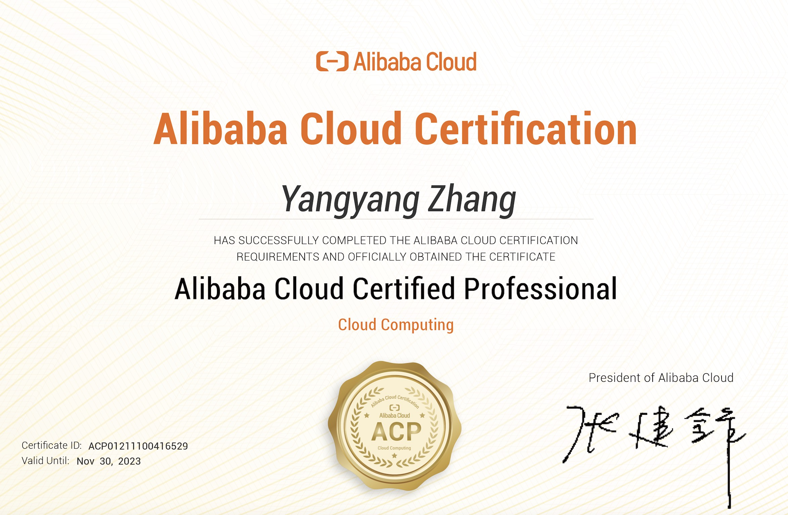
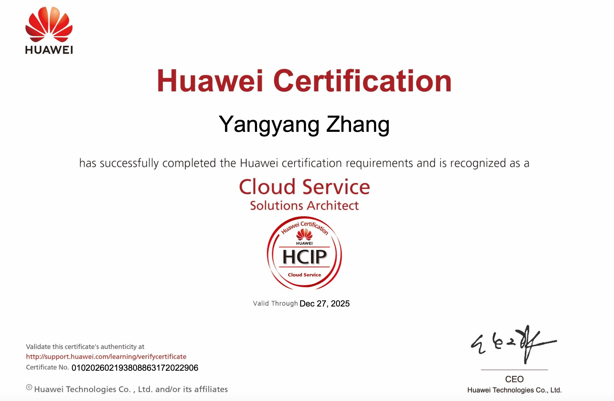
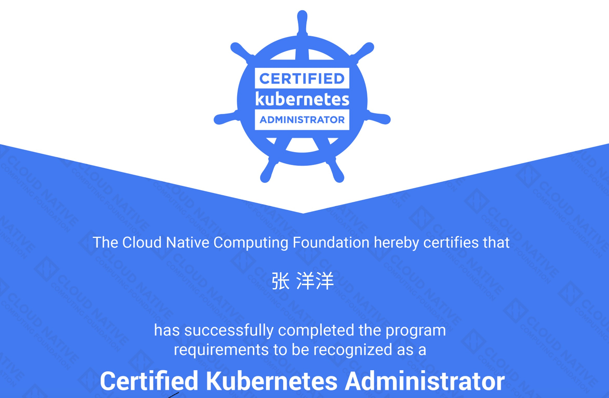

## :raised_hand_with_fingers_splayed: Hi, I’m Yangyang Zhang.

------

### Bout Me

- :bulb: I like to explore new technologies and develop software solutions and hacks.
- :computer: I'm currently learning python, golang and kubernetes.
- :mailbox: You can shoot me an email at zyyyxdz@outlook.com! I will reply as soon as possible.

### Languages and Frameworks

### Tools and Environments

### Certificates and Honors

  

